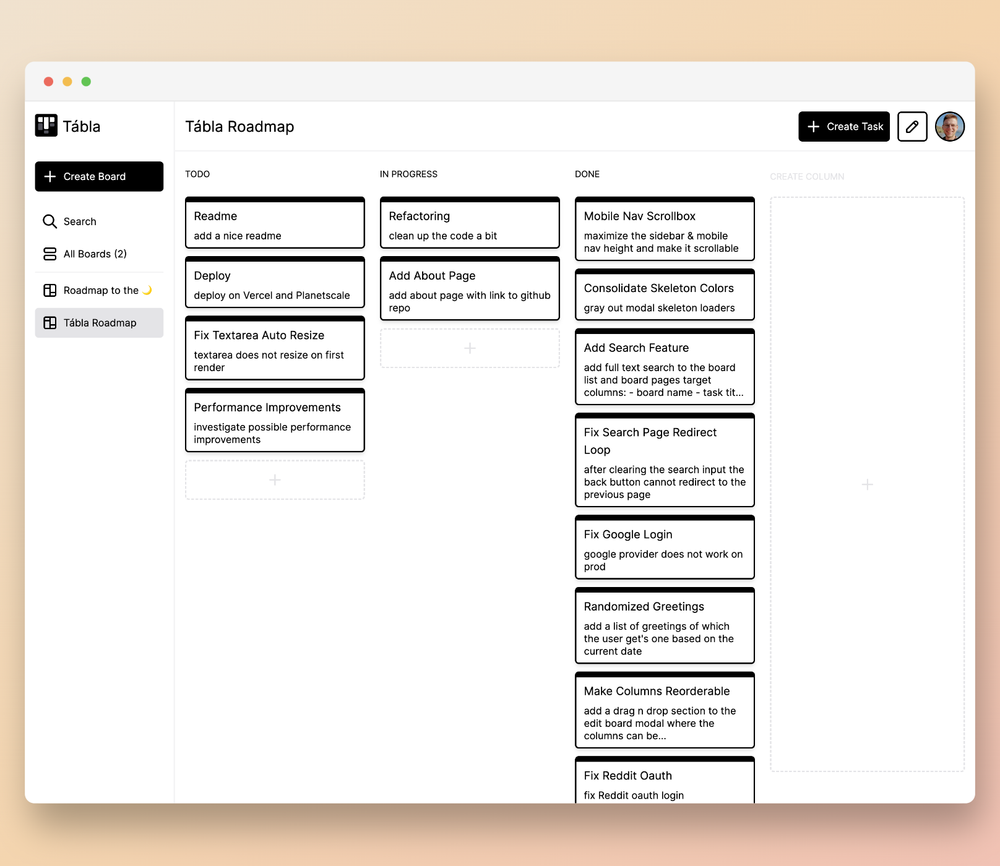

<div align="center">
  <a href="https://tabla.bmolnar.dev">
    <picture>
      <source media="(prefers-color-scheme: dark)" srcset="public/tabla_logo_light.svg">
      
    </picture>
  </a>

  <h2 align="center">Tábla</h2>

  <p align="center">
    A Kanban Board Experiment
    <br />
    <a href="https://tabla.bmolnar.dev"><strong>Try the Demo »</strong></a>
    <br />
    <br />
    <a href="https://github.com/bencemol/tabla/issues">Report a Bug</a>
  </p>
</div>

## About The Project



Next.js 13 introduced the new [App Router](https://beta.nextjs.org/), this project is an attempt to demo a subset of the new features I have found interesting.

Showcased features:

- file-system based routing
- data fetching using React Server Components
- loading UI with React Suspense
- route handlers

To add a bit to the challenge, I've included a minimal (sometimes flaky) drag-n-drop feature based on the [HTML Drag and Drop API](https://developer.mozilla.org/en-US/docs/Web/API/HTML_Drag_and_Drop_API).

### Built With

- [Next.js 13](https://beta.nextjs.org)
- [Prisma](https://www.prisma.io/)
- [NextAuth.js](https://next-auth.js.org/)
- [Zod](https://zod.dev/)
- [SWR](https://swr.vercel.app/)
- [Tailwindcss](https://tailwindcss.com/)
- [Tabler Icons](https://tabler-icons.io/)

## Getting Started

To get a local copy up and running follow these steps.

### Prerequisites

- Node.js version > 18
- MySql database
  <br/>
  If you're planning to run it with Docker on arm64, I recommend using the [arm64v8/mysql](https://hub.docker.com/r/arm64v8/mysql/) image.
- set up a `.env` file based on [.env.example](.env.example)

### Installation

1. Install Node dependencies
   ```sh
   npm i
   ```
2. Generate the Prisma client
   ```sh
   npx prisma generate
   ```
3. Migrate your database schema
   ```sh
   npx prisma migrate dev
   ```

### Running the Development Server

The dev server can be started by running:

```sh
npm run dev
```

## License

Distributed under the MIT License. See [LICENSE.md](LICENSE.md) for more information.
